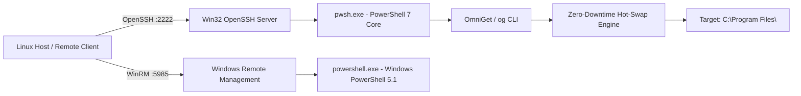

# Headless & Windows Server Core Deployment

OmniGet is specifically tuned for **Windows Server Core**, headless developer nodes, automated virtualization guests (KVM/QEMU, Proxmox, Docker), and remote terminal access.

---

## 🏗️ Architecture in Headless Environments

In a headless Windows Server Core node, there is no classic Windows Explorer shell or graphical desktop. System administrators and remote AI agents interact exclusively via **OpenSSH Server** and **PowerShell Remoting (WinRM)**:



---

## 🚀 Headless Remote Administration

### 1. Connecting via OpenSSH
When you connect to a Windows Core node via SSH:

```bash
ssh -p 2222 samuelcaldas@127.0.0.1
```

You are placed into a high-performance PowerShell 7 shell session. Because OmniGet is registered in the **Machine `PATH`**, the `og` command is immediately available:

```powershell
# Check versions
og version

# Search for applications
og search docker

# Install tools headlessly without prompts
og install git gh docker-cli nodejs -s
```

### 2. Upgrading PowerShell 7 Headlessly Over SSH
On standard Windows systems, updating the active shell terminates the session. With OmniGet's zero-downtime hot-swap engine, you can update PowerShell 7 over the very SSH session running it:

```powershell
og install pwsh -s
```

The active SSH connection stays open, the store completes with `[SUCCESS]`, and subsequent commands automatically invoke the updated runtime.

---

## 📦 Zero-Touch Unattended Bootstrapping

OmniGet supports dual-drive offline deployment during Windows unattended setup (`autounattend.xml`):

### 1. Staging the Package
Place the zipped repository into `packages/omniget.zip` on your installation media or secondary virtual drive (OEMDRV):

```bash
cd external/omniget && zip -rq /path/to/media/packages/omniget.zip .
```

### 2. Unattended Installation (`Specialize.ps1`)
During the Windows Setup Specialize pass, invoke `Install-OmniGet.ps1 -DeployOnly`:

```powershell
# Specialize.ps1
Write-Host "Deploying OmniGet Package Engine during specialization..."
& "C:\Provisioning\scripts\Install-OmniGet.ps1" -DeployOnly

# Register OmniGet in Machine PATH
$omniBin = "C:\Program Files\OmniGet\bin"
$machinePath = [System.Environment]::GetEnvironmentVariable('Path', 'Machine')
if ($machinePath -notlike "*$omniBin*") {
    [System.Environment]::SetEnvironmentVariable('Path', "$omniBin;$machinePath", 'Machine')
}
```

When Windows Setup finishes and the system boots for the first time, OmniGet is fully functional with no internet access required for base installation.

---

## 🖥️ Turning Server Core into a Lightweight Desktop

Windows Server Core uses ~500MB of RAM without the bloated Windows Explorer desktop. If graphical interaction or window management is ever required for specific tools, OmniGet provides the **`SystemShells`** preset:

```powershell
og preset SystemShells -s
```

This installs:
- **WinXShell**: An ultra-fast, 15MB Win32 taskbar, start menu, and notification area.
- **WinFile**: Microsoft's classic open-source File Manager.
- **WezTerm**: Multi-tab terminal with GPU/software OpenGL rendering.
- **Hosts Blocklist**: Zero-overhead DNS blocklist (13,000+ domains) to prevent telemetry and ads.

---

## 🔒 Security & Filesystem Standards

OmniGet strictly follows enterprise security rules:
- **No Root `C:\` Installations**: All software is installed in standard `C:\Program Files` or `C:\ProgramData` directories with correct Access Control Lists (ACLs).
- **Non-Expiring Service Accounts**: Configured to run cleanly under both standard user and administrative security contexts.
- **No Uncontrolled Restarts**: All installations suppress automatic system reboots (`/norestart`), keeping headless servers online.
