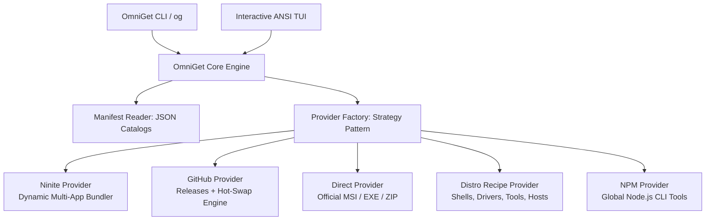

# Welcome to the OmniGet Wiki

[](https://github.com/PowerShell/PowerShell)
[](https://opensource.org/licenses/MIT)
[](https://microsoft.com/windows)

**OmniGet (`og`)** is an ultra-fast, multi-source package manager and interactive terminal store for Windows. It seamlessly aggregates and automates software installations across **Ninite**, **GitHub Releases**, **Official Direct Packages**, **Distro Recipes**, and **Global Runtimes** with zero bloatware, zero telemetry, and zero downtime.

---

## 📚 Wiki Table of Contents

| Section | Description |
| :--- | :--- |
| 🚀 **[Getting Started](Getting-Started)** | Installation methods, system requirements, and first-run guide. |
| 💻 **[CLI Reference](CLI-Reference)** | Complete reference for `og` subcommands (`install`, `search`, `list`, `preset`, `update`, `version`, `help`). |
| 🎮 **[TUI User Guide](TUI-User-Guide)** | Interactive ANSI curses store, keyboard shortcuts, Vim navigation, and tabs. |
| 🌐 **[Providers & Sources](Providers-and-Sources)** | Deep dive into Ninite, GitHub Releases, Direct Vendor, Distro Recipes, and NPM providers. |
| 📦 **[Presets & Bundles](Presets-and-Bundles)** | Predefined toolchain bundles (`DevStack`, `Browsers`, `Minimal`, `Utilities`, `SystemShells`, `Media`). |
| ⚙️ **[Architecture & Design Patterns](Architecture-and-Design-Patterns)** | Software architecture, Strategy and Factory patterns, Clean Code, and Object Calisthenics. |
| ⚡ **[Zero-Downtime Updates](Zero-Downtime-Updates)** | In-use executable hot-swapping, handle persistence in Windows NT, and Restart Manager deactivation. |
| 📝 **[Manifest Authoring Guide](Manifest-Authoring-Guide)** | Declarative JSON manifest schema, syntax, and instructions for adding new packages. |
| 🖥️ **[Headless & Windows Server Core](Headless-and-Windows-Core-Deployment)** | Automation over OpenSSH, unattended OS installation, WinRM, and Docker/KVM environments. |
| 🔧 **[Troubleshooting & FAQ](Troubleshooting-and-FAQ)** | Solutions for common errors, network timeouts, execution policies, and permission issues. |

---

## ⚡ Core Philosophy & Key Features



### 1. Multi-Source Aggregation
No single package manager covers everything cleanly. OmniGet combines the best sources into one unified catalog:
- **Ninite Engine**: Generates customized, multi-app silent installers on-the-fly from over 140+ curated desktop utilities.
- **GitHub Releases**: Fetches modern developer tools straight from official GitHub repository releases with automated tag resolution.
- **Direct Official Installers**: Silently runs vendor MSI and EXE installers (.NET SDK, Node.js, Python, Visual C++ Redistributables).
- **Distro System Recipes**: Installs lightweight desktop environments (WinXShell, ReactShell, WinFile, Explorer++), VirtIO drivers, and zero-route DNS hosts blocklists.
- **Global NPM Runtimes**: Deploys agentic AI tools and CLI assistants (such as Claude Code) with automatic node validation.

### 2. Zero-Downtime Hot-Swap Upgrades
Upgrading a running shell or runtime (such as PowerShell 7) typically causes Windows to lock executable files and terminate active sessions. OmniGet features a specialized **Zero-Downtime Hot-Swap Engine**:
- Active in-use binaries are automatically rotated to `.old_<timestamp>`.
- Windows NT preserves active memory-mapped handles to the executing files.
- Active OpenSSH sessions and terminal windows **never disconnect or crash**.
- New commands and future sessions immediately resolve to the upgraded binaries.

### 3. Native & Headless Ready
OmniGet is engineered from the ground up to run across the entire Windows ecosystem:
- Windows 11 & 10 (Workstations & Laptops)
- Windows Server 2019 / 2022 / 2025 (Full GUI & Server Core)
- Minimal & Headless environments over OpenSSH Server or WinRM
- Windows Preinstallation Environment (WinPE)

---

## 🏁 Quick Demonstration

```powershell
# Search for packages across all providers
og search git

# Install packages silently
og install vscode git gh pwsh -s

# Deploy full developer stack
og preset DevStack -s

# Launch interactive visual store
og
```

Explore the **[Getting Started](Getting-Started)** guide to begin using OmniGet on your machine.
