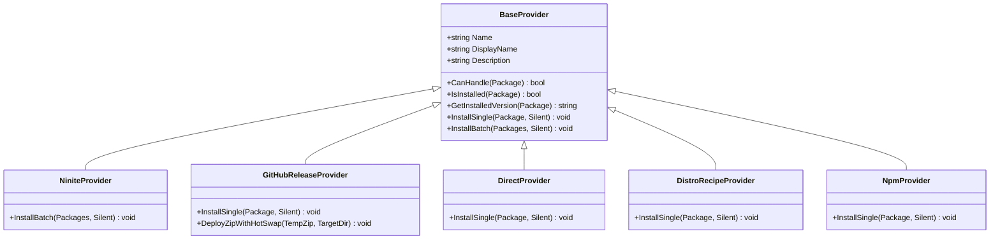

# OmniGet Providers & Sources

OmniGet is architected around a flexible **Strategy Pattern**. Instead of relying on a single, monolithic package format or repository, OmniGet delegates package downloads, extractions, and executions to specialized **Providers**.

---

## 🏗️ Provider Architecture Overview



Each provider implements the abstract `BaseProvider` contract defined in [`src/Providers/BaseProvider.ps1`](file:///home/samuelcaldas/repos/windows-core/external/omniget/src/Providers/BaseProvider.ps1).

---

## 1. Ninite Provider

- **Implementation**: [`NiniteProvider.ps1`](file:///home/samuelcaldas/repos/windows-core/external/omniget/src/Providers/NiniteProvider.ps1)
- **Manifest Catalog**: [`manifests/ninite.json`](file:///home/samuelcaldas/repos/windows-core/external/omniget/manifests/ninite.json) (140+ applications)
- **Source Identifier**: `"source": "ninite"`

### Dynamic Multi-App Bundling Mechanics
Ninite provides a public engine that combines multiple application installers into a single, signed executable by chaining their unique URL slugs.

When you install multiple Ninite applications with OmniGet:
```powershell
og install chrome 7zip vlc notepadplusplus -s
```

OmniGet intercepts all selected Ninite items and generates a single dynamic bundle URL:
```text
https://ninite.com/chrome-7zip-vlc-notepadplusplus/ninite.exe
```

### Key Advantages:
1. **Single Download**: Multiple applications are fetched and verified in a single HTTP request.
2. **Zero Adware / Bloatware**: Ninite automatically unchecks all browser toolbars, adware, and companion software.
3. **Architecture Detection**: Automatically selects 64-bit or 32-bit binaries matching the host OS.
4. **Silent Background Execution**: Runs silently with no user prompts or wizard dialogs.

---

## 2. GitHub Release Provider

- **Implementation**: [`GitHubReleaseProvider.ps1`](file:///home/samuelcaldas/repos/windows-core/external/omniget/src/Providers/GitHubReleaseProvider.ps1)
- **Manifest Catalog**: [`manifests/github.json`](file:///home/samuelcaldas/repos/windows-core/external/omniget/manifests/github.json)
- **Source Identifier**: `"source": "github"`

The GitHub Release Provider handles modern developer tooling directly from GitHub Releases (e.g. `PowerShell/PowerShell`, `cli/cli`, `git-for-windows/git`).

### Features & Capabilities:
- **Format Support**: Handles `.exe`, `.msi`, and `.zip` release assets.
- **Windows Restart Manager Deactivation**: Whenever an MSI package is executed, OmniGet injects:
  ```powershell
  msiexec.exe /i "<package>.msi" /qn /norestart MSIRESTARTMANAGERCONTROL=Disable
  ```
  This prevents Windows Installer from terminating active OpenSSH terminal sessions or running shells.
- **Zero-Downtime Hot-Swap Engine**: When extracting `.zip` archives into live directories (such as `C:\Program Files\PowerShell\7`), in-use locked files are rotated to `.old_<timestamp>`, allowing running shells to continue operating without disruption.

---

## 3. Direct Provider

- **Implementation**: [`DirectProvider.ps1`](file:///home/samuelcaldas/repos/windows-core/external/omniget/src/Providers/DirectProvider.ps1)
- **Manifest Catalog**: [`manifests/direct.json`](file:///home/samuelcaldas/repos/windows-core/external/omniget/manifests/direct.json)
- **Source Identifier**: `"source": "direct"`

The Direct Provider downloads and executes official vendor packages directly from their canonical CDN or download server.

### Examples:
- **Node.js LTS**: Downloads official MSI from `nodejs.org` and runs silent MSI installation.
- **Python 3.12**: Downloads official executable installer from `python.org` and configures machine PATH and pip silently:
  ```powershell
  /quiet InstallAllUsers=1 PrependPath=1 Include_test=0 Include_pip=1
  ```
- **Visual C++ 2015–2022 Redistributable**: Downloads `vc_redist.x64.exe` from `aka.ms` and installs silently with `/install /quiet /norestart`.

---

## 4. Distro Recipe Provider

- **Implementation**: [`DistroRecipeProvider.ps1`](file:///home/samuelcaldas/repos/windows-core/external/omniget/src/Providers/DistroRecipeProvider.ps1)
- **Manifest Catalog**: [`manifests/distro.json`](file:///home/samuelcaldas/repos/windows-core/external/omniget/manifests/distro.json)
- **Source Identifier**: `"source": "distro"`

The Distro Recipe Provider allows executing complex, declarative PowerShell configuration recipes that go beyond standard single-file installers.

### Built-in Recipes:

| Recipe Name | Target Location | Description |
| :--- | :--- | :--- |
| **`Install-DotNetSdk`** | `C:\Program Files\dotnet` | Downloads and executes Microsoft's official `dotnet-install.ps1` to deploy .NET 10.0 and registers machine PATH. |
| **`Install-DockerCli`** | `C:\Program Files\Docker` | Downloads standalone official Docker CLI (`docker.exe`) and Docker Compose CLI plugin (`docker-compose.exe`) for remote daemon management without Docker Desktop. |
| **`Install-GiteaCli`** | `C:\Program Files\Gitea CLI` | Downloads official Gitea `tea.exe` binary and adds it to machine PATH. |
| **`Install-HostsBlocklist`**| `C:\Windows\System32\drivers\etc\hosts` | Fetches Dan Pollock's zero-route (`0.0.0.0`) adblock/malware/telemetry hosts file and flushes DNS cache. |
| **`Install-WinXShell`** | `C:\Program Files\WinXShell` | Sets up lightweight Win32 desktop shell, start menu, and taskbar for Windows Server Core. |
| **`Install-WinFile`** | `C:\Program Files\WinFile` | Deploys classic Microsoft Windows File Manager for Server Core environments. |
| **`Install-Terminal`** | `C:\Program Files\WindowsTerminal` | Installs WezTerm terminal emulator with software OpenGL rendering and `wt.exe` alias. |
| **`Install-AntigravityDaemon`** | `~/.gemini/antigravity-cli/bin` | Deploys Google Antigravity Remote Control daemon service for headless agent control on port 9090. |

---

## 5. NPM Provider

- **Implementation**: [`NpmProvider.ps1`](file:///home/samuelcaldas/repos/windows-core/external/omniget/src/Providers/NpmProvider.ps1)
- **Source Identifier**: `"source": "npm"`

The NPM Provider manages global Node.js command-line tools.

### Key Capabilities:
- Automatically verifies if `node` and `npm` are installed.
- Executes `npm.cmd install -g <package>` in silent mode.
- Enables one-command installation of modern agentic CLI tools, such as Anthropic's Claude Code:
  ```powershell
  og install claude-code -s
  ```
