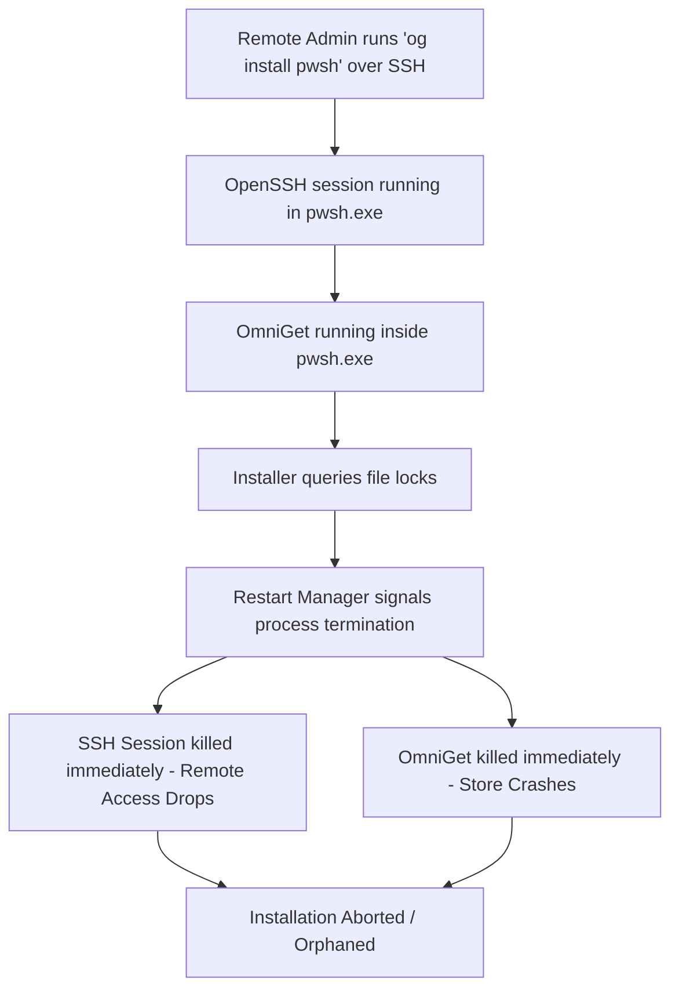
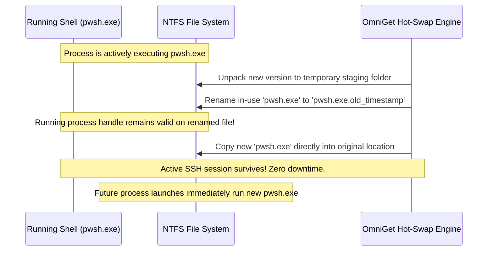

# Zero-Downtime Updates & Process Resilience

One of OmniGet's most advanced capabilities is its ability to perform **zero-downtime, in-place software upgrades on running executables and active shells** (such as PowerShell 7) without dropping remote SSH sessions or crashing the package manager.

---

## 🛑 The Windows File-Locking Challenge

On Windows NT, executing binaries and active DLLs are locked by the operating system kernel via `SEC_IMAGE` memory-mapping flags. If an installer attempts to overwrite an active binary directly, Windows rejects the operation:

```text
System.IO.IOException: The process cannot access the file because it is being used by another process.
```

### The Cascading Disconnection Problem

In headless Windows Server Core environments:
1. **OpenSSH Shell Host**: The OpenSSH Server spawns `C:\Program Files\PowerShell\7\pwsh.exe` as the administrator's default interactive shell.
2. **OmniGet Execution**: When the administrator runs `og install pwsh` or launches the visual store, OmniGet runs inside that same `pwsh.exe` process tree.
3. **Windows Restart Manager**: Standard Windows installers (including official MSI packages) query Windows Restart Manager (`RmGetList`). When Restart Manager detects that `pwsh.exe` has locks on files in `C:\Program Files\PowerShell\7`, it forcibly terminates all `pwsh.exe` processes (`RmShutdown`).
4. **The Disaster**:
   - The OpenSSH shell is killed -> The remote SSH connection drops immediately.
   - OmniGet is terminated mid-flight -> The store closes abruptly before installation completes.
   - The installation is left half-finished or rolled back.



---

## 🔬 The Solution: Windows NT Handle Persistence

While Windows NT prevents *deleting* or *overwriting* an in-use binary, **the NTFS file system explicitly allows renaming executing binaries and active DLLs**!

When an open executable is renamed:
1. Its file record is updated in the Master File Table (MFT).
2. Existing open file handles, memory mappings, and running threads remain attached to the original data blocks.
3. The original file path becomes immediately available for a new file to be written.



---

## 🛠️ Implementation in OmniGet

### 1. File-Level In-Use Hot-Swap (`DeployZipWithHotSwap`)

In [`src/Providers/GitHubReleaseProvider.ps1`](file:///home/samuelcaldas/repos/windows-core/external/omniget/src/Providers/GitHubReleaseProvider.ps1), OmniGet implements an intelligent hot-swap deployment algorithm:

```powershell
# 1. Unpack into an isolated staging area
Expand-Archive -Path $tempFile -DestinationPath $stagingDir -Force

# 2. Iterate through all files in the release
foreach ($fileItem in $allFiles) {
    $rel = $fileItem.FullName.Substring($stagingDir.Length).TrimStart('\', '/')
    $destF = Join-Path $targetDir $rel
    
    if (Test-Path $destF) {
        try {
            # Attempt direct copy first (for un-locked files)
            Copy-Item -Path $fileItem.FullName -Destination $destF -Force -ErrorAction Stop
        }
        catch {
            # In-use locked binary: rotate to .old_<timestamp> and copy new
            $oldF = "$destF.old_$timestamp"
            Rename-Item -Path $destF -NewName (Split-Path -Leaf $oldF) -Force
            Copy-Item -Path $fileItem.FullName -Destination $destF -Force
        }
    } else {
        Copy-Item -Path $fileItem.FullName -Destination $destF -Force
    }
}
```

### 2. Windows Restart Manager Suppression

For MSI-based installations, OmniGet explicitly passes the `MSIRESTARTMANAGERCONTROL=Disable` property to `msiexec.exe`:

```powershell
Start-Process -FilePath "msiexec.exe" -ArgumentList "/i `"$tempFile`" /qn /norestart MSIRESTARTMANAGERCONTROL=Disable" -Wait
```

This instructs Windows Installer not to shut down processes holding file locks, preventing unexpected disconnections.

### 3. Housekeeping & Cleanup

On subsequent executions, OmniGet automatically sweeps the installation directory and cleans up previously rotated `.old_*` files once all processes referencing them have gracefully terminated:

```powershell
$oldFiles = @(Get-ChildItem -Path $targetDir -Recurse -Filter "*.old_*" -ErrorAction SilentlyContinue)
foreach ($oldItem in $oldFiles) {
    Remove-Item -Path $oldItem.FullName -Force -ErrorAction SilentlyContinue
}
```

---

## 📊 Summary of Benefits

| Feature | Standard Windows Update | OmniGet Zero-Downtime Hot-Swap |
| :--- | :--- | :--- |
| **Active SSH Connection** | ❌ Abruptly terminated | ✅ 100% Preserved |
| **Interactive Store UI** | ❌ Crashes mid-flight | ✅ Continues running smoothly |
| **Installation Integrity** | ⚠️ High risk of rollback/corruption | ✅ Guaranteed atomic completion |
| **Immediate Activation** | ⚠️ Requires full system reboot | ✅ New commands use updated version immediately |
